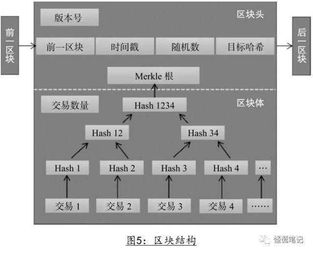
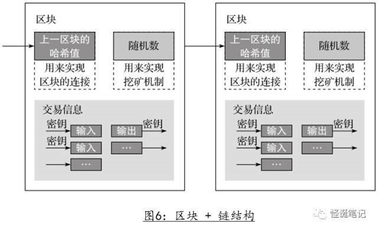

# 区块链基础

## 区块链定义

指通过**P2P**网络，使用密码学方法，实现了去中心化和去第三方信任并集体维护一个可靠的分布式数据库的技术方案。

## 区块链特点

1. 去中心化 Decentralized
2. 去信任 Trustless
3. 自治的 Autonomous
4. 可追溯的 Trackable
5. 可靠数据库 Reliable Database
6. 匿名性 Anonymity

## 区块链的分类

1. 共有链
2. 联盟链
3. 私有链

## 区块链的技术结构

### 数据层

​	从技术上来讲，区块是一种记录交易的数据结构，反映了一笔交易的资金流向。系统中已经达成的交易的区块连接在一起形成了一条主链，所有参与计算的节点都记录了主链或主链的一部分。

​	每个区块由区块头和区块体组成，区块体只负责记录前一段时间内的所有交易信息，主要包括**交易数量**和**交易详情**；区块头则封装了当前的**版本号**、前一区块地址、**时间戳**（记录该区块产生的时间，精确到秒）、**随机数**（记录解密该区块相关数学题的答案的值）、**当前区块的目标哈希值**、**Merkle树的根值**等信息。从结构来看，区块链的大部分功能都由区块头实现。

​	

​	概括来看，一个区块包含以下三部分：**交易信息**、**前一个区块形成的哈希散列**、**随机数**。

​	

​	交易信息是区块所承载的任务数据，具体包括交易双方的私钥、交易的数量、电子货币的数字签名等；前一个区块形成的哈希散列用来将区块连接起来，实现过往交易的顺序排列；随机数是交易达成的核心，所有矿工节点竞争计算随机数的答案，最快得到答案的节点生成一个新的区块，并广播到所有节点进行更新，如此完成一笔交易。

### 网络层

​	区块链采用了P2P网络技术，P2P网络具有去中心化与健壮性等特点。

### 共识层

​	共识机制，就是所有记账节点之间如何达成共识，去认定一个记录的有效性，共识机制算法是区块链的核心技术，因为这决定了区块的产生，而记账决定方式将会影响整个系统的安全性和可靠性。

目前最为知名几种共识算法的主要有：

- 工作量证明机制（PoW，Proof of Work）

- 权益证明机制（PoS，Proof of Stake）

- 股份授权证明机制（DPoS，Delegated Proof of Stake）

- 实用拜占庭容错算法（PBFT）

**PoW**（**Proof of Work**，工作量证明）

​	PoW机制，也就是像比特币的挖矿机制，矿工通过把网络尚未记录的现有交易打包到一个区块，然后不断遍历尝试来寻找一个随机数，使得新区块加上随机数的哈希值满足一定的难度条件。找到满足条件的随机数，就相当于确定了区块链最新的一个区块，也相当于获得了区块链的本轮记账权。矿工把满足挖矿难度条件的区块在网络中广播出去，全网其他节点在验证该区块满足挖矿难度条件，同时区块里的交易数据符合协议规范后，将各自把该区块链接到自己版本的区块链上，从而在全网形成对当前网络状态的共识。

**PoS**（**Proof of Stake**，权益证明）

​	PoS机制，要求节点提供拥有一定数量的代币证明来获取竞争区块链记账权的一种分布式共识机制。如果单纯依靠代币余额来决定记账者必然使得富有者胜出，导致记账权的中心化，降低共识的公正性，因此不同的PoS机制在权益证明的基础上，采用不同方式来增加记账权的随机性来避免中心化。

**DPoS**（**Delegated Proof-Of-Stake**，股份授权证明）

​	DPoS很容易理解，类似于现代企业董事会制度。DPoS机制是由持股者投票选出一定数量的见证人，每个见证人按序有两秒的权限时间生成区块，若见证人在给定的时间片不能生成区块，区块生成权限交给下一个时间片对应的见证人。持股人可以随时通过投票更换这些见证人。DPoS的这种设计使得区块的生成更为快速，也更加节能。

从某种角度来说，DPOS可以理解为多中心系统，兼具去中心化和中心化优势。

**分布式一致性算法**

​	分布式一致性算法是基于传统的分布式一致性技术。其中有分为解决拜占庭将军问题的拜占庭容错算法，如PBFT（拜占庭容错算法）。另外解决非拜占庭问题的分布式一致性算法（Paxos、Raft），该类算法目前是联盟链和私有链场景中常用的共识机制。

优点：实现秒级的快速共识机制，保证一致性。

缺点：去中心化程度不如公有链上的共识机制；更适合多方参与的多中心商业模式。

**PBFT**：实用拜占庭容错算法

​	PBFT是一种状态机副本复制算法，即服务作为状态机进行建模，状态机在分布式系统的不同节点进行副本复制。每个状态机的副本都保存了服务的状态，同时也实现了服务的操作。

### 激励层

​	以比特币为例。

​	比特币最开始由系统奖励给那些创建新区块的矿工，该奖励大约每四年减半。刚开始每记录一个新区块，奖励矿工50个比特币，该奖励大约每四年减半。依次类推，到公元2140年左右，新创建区块就没有系统所给予的奖励了。届时比特币全量约为**2100万个**，这就是比特币的总量，所以不会无限增加下去。

​	另外一个激励的来源则是交易费。新创建区块没有系统的奖励时，矿工的收益会由系统奖励变为收取交易手续费。例如，你在转账时可以指定其中1%作为手续费支付给记录区块的矿工。如果某笔交易的输出值小于输入值，那么差额就是交易费，该交易费将被增加到该区块的激励中。只要既定数量的电子货币已经进入流通，那么激励机制就可以逐渐转换为完全依靠交易费，那么就不必再发行新的货币。

### 智能合约层

​	智能合约是一组情景应对型的程序化规则和逻辑，是通过部署在区块链上的去中心化、可信共享的脚本代码实现的。通常情况下，智能合约经各方签署后，以程序代码的形式附着在区块链数据上，经P2P网络传播和节点验证后记入区块链的特定区块中。智能合约封装了预定义的若干状态及转换规则、触发合约执行的情景、特定情景下的应对行动等。区块链可实时监控智能合约的状态，并通过核查外部数据源、确认满足特定触发条件后激活并执行合约。

